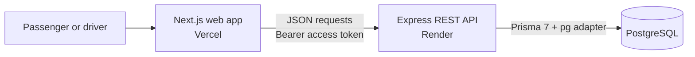
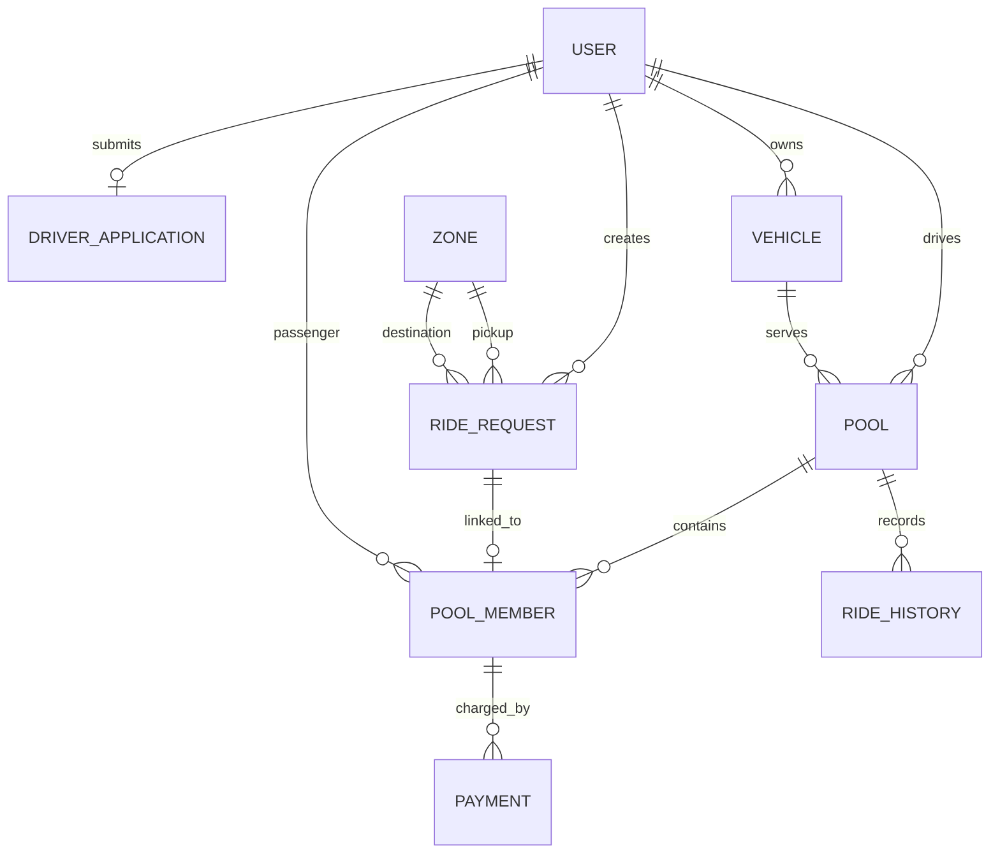

# Dhaka Tesla Pool

Dhaka Tesla Pool is a ride-pooling MVP for Dhaka. It addresses the cost and occupancy problem of single-passenger city trips by letting drivers combine passenger ride requests in one shared Tesla pool. Passengers choose from named zones; drivers review pending requests and accept them into a pool. The current implementation demonstrates the request-to-completion journey, fare accounting, and payment records.

## 🎥 Project Walkthrough

[Watch the project walkthrough](https://app.usebubbles.com/bM8RzuSMA6j2HZKtWr4w7T/recording-sep-30-2026)

## Project links

| Resource | URL |
|---|---|
| Live frontend (Vercel) | [https://dhaka-tesla-app.vercel.app/](https://dhaka-tesla-app.vercel.app/) |
| Backend API (Render) | [https://tesla-bullet-app.onrender.com/api/v1](https://tesla-bullet-app.onrender.com/api/v1) |
| API health check | [GET /health](https://tesla-bullet-app.onrender.com/api/v1/health) |

## Implemented features

| Area | Current implementation |
|---|---|
| Passenger | Register/sign in, browse zones, request seats, inspect and cancel eligible requests, review ride and payment history. |
| Driver | Apply for driver access, create/manage vehicles, set a vehicle online/offline, review pending requests, create pools, accept requests up to capacity, progress a ride, and review ride/payment history. |
| Pooling | Drivers manually accept pending ride requests into a pool. A vehicle can have only one active pool at a time. Seat usage is counted from each request's `requestedSeats`. The available request list is global; route and zone matching are not implemented. |
| Payments | After pool completion, passengers can record Cash (pending driver confirmation) or simulated TeslaPay (immediately successful). TeslaPay does not charge a wallet or payment gateway. |
| History | Passenger request/payment history, driver pool history, and a shared event timeline for each pool. |
| Onboarding | Public registration creates a passenger. The authenticated driver application flow records license and vehicle details, sets the application to approved immediately, and changes the user role to driver. Driver vehicles are then created in the vehicle flow. |

## Architecture



The frontend is a Next.js App Router application. Feature modules group API calls, types, query and mutation options, hooks, and validation. The backend follows Express routes → controllers → services, with Zod validation and shared authentication, error, and utility code. PostgreSQL stores users, zones, vehicles, requests, pools, members, payments, and pool history.

## Ride and payment lifecycle

```mermaid
flowchart TD
    A[Passenger creates ride request\nPENDING]
    B[Driver creates empty pool\nREQUESTED]
    C[Driver accepts pending request(s)\nRequest: ACCEPTED\nPool: MATCHED]
    D[Driver marks arrival\nDRIVER_ARRIVED]
    E[Driver starts ride\nSTARTED]
    F[Driver completes ride\nCOMPLETED]
    G{Passenger chooses payment}
    H[Cash payment\nPENDING]
    I[Driver confirms cash\nSUCCESS]
    J[Simulated TeslaPay\nSUCCESS]
    X[Request cancelled]
    Y[Pool cancelled before start\nActive members/requests cancelled]
    A --> B --> C --> D --> E --> F --> G
    A --> X
    B --> Y
    C --> Y
    D --> Y
    G --> H --> I
    G --> J
```

The pool status sequence is `REQUESTED → MATCHED → DRIVER_ARRIVED → STARTED → COMPLETED`. A driver may cancel at `REQUESTED`, `MATCHED`, or `DRIVER_ARRIVED`. A passenger can cancel a `PENDING` request directly, or an accepted request while its pool has not started; the member fare is then removed from the pool estimate. Pool lifecycle events are stored in `RideHistory`. Payment creation is permitted only after completion. `actualFare` exists as a nullable field and is not populated by lifecycle transitions.

## Fare model and currency storage

```text
Estimated fare (paisa) = 3,000 + 1,500 × ceil(Haversine distance in km)
```

The estimate uses pickup and destination zone coordinates, straight-line Haversine distance, and rounds distance up to a whole kilometre. It is not a road-distance, traffic, or navigation quote. One taka is 100 paisa. Request estimates, pool/member fares, and payment amounts are stored as integer database fields in paisa to avoid decimal currency arithmetic. Pool estimated fare starts at zero, increases by accepted request fares, and decreases if an eligible member cancels.

## Authentication and authorization

- Registration creates an active `PASSENGER`; email is trimmed and lowercased, and email/optional phone are unique.
- Passwords use Node.js `scrypt` with a random salt; password comparison uses a constant-time comparison.
- Login issues HS256 JWT access tokens (15 minutes) and refresh tokens (7 days). Refresh issues a new access token and does not rotate the refresh token.
- Protected routes require a bearer access token. Role middleware separates passenger and driver operations. Service queries and mutations enforce ownership of passenger requests, driver pools, vehicles, and pool-member payments.
- Zod validates request bodies. The API configures Helmet, CORS, JSON parsing, not-found handling, and a global error handler.

## Data model and ERD



Prisma models are split across `backend/prisma/models/`. Migrations are in `backend/prisma/migrations/`. The schema represents a pool member as the link between one ride request, its passenger, and a pool; payments belong to pool members, and lifecycle events belong to pools.

## Technology choices and trade-offs

| Technology | Use here | Practical trade-off / alternative |
|---|---|---|
| Next.js App Router, React, TypeScript | Frontend pages, layouts, components, typed client | Integrated routing and React UI; a standalone React/Vite client could be simpler for a smaller app. |
| Tailwind CSS, Base UI, Lucide | Styling, UI primitives, icons | Utility styling and composable primitives; a component framework could provide more prebuilt layouts. |
| TanStack Query, Redux Toolkit | API query/mutation state and client auth/theme state | Separates server cache from client state; a smaller app could keep more state local. |
| React Hook Form, Zod | Form handling and validation | Reusable form/schema validation; validation is also required independently on the server. |
| Node.js, TypeScript, Express 5 | HTTP API and modular service logic | Small, explicit middleware model; NestJS or another framework could add stronger conventions. |
| PostgreSQL, Prisma 7, `pg` adapter | Relational data, migrations, database queries | Relational constraints and transactions suit ride/pool relationships; raw SQL plus another mapper is an alternative but loses Prisma's typed model workflow. |
| `jose`, Node `crypto` | JWT and scrypt password handling | Existing small focused libraries; a hosted identity provider would reduce custom auth responsibilities. |
| pnpm, Docker Compose | Package management and local API/database stack | Reproducible installs and local services; a managed development environment is another option. |
| Vercel, Render | Production frontend and API hosting | Separate deployments fit the frontend/API split; a single platform could reduce deployment coordination. |

## Repository structure

```text
.
├── backend/
│   ├── docs/                 # API contract and Docker notes
│   ├── prisma/               # Models, migrations, and zone seed
│   ├── src/
│   │   ├── common/           # Errors, middleware, shared utilities
│   │   ├── config/           # Environment and database setup
│   │   └── modules/          # Auth, driver, pool, payment, ride, vehicle, zone
│   ├── tests/                # Node test runner suites
│   ├── Dockerfile
│   └── docker-compose.yml
└── frontend/
    ├── app/                  # Next.js routes and layouts
    ├── components/           # Auth, driver, passenger, payment, shared UI
    └── lib/features/         # Feature APIs, types, schemas, queries, mutations
```

## Environment variables

Use only the checked-in `.env.example` files as the source for application variable names and example formatting. Copy them for local use and replace placeholders with local values; never publish real values.

| Variable | Example file | Purpose |
|---|---|---|
| `NODE_ENV` | `backend/.env.example` | Runtime mode |
| `PORT` | `backend/.env.example` | API listen port |
| `HOST` | `backend/.env.example` | API bind host |
| `DATABASE_URL` | `backend/.env.example` | PostgreSQL connection string |
| `JWT_ACCESS_SECRET` | `backend/.env.example` | Access-token signing secret |
| `JWT_REFRESH_SECRET` | `backend/.env.example` | Refresh-token signing secret |
| `NEXT_PUBLIC_API_BASE_URL` | `frontend/.env.example` | Absolute HTTP(S) API base URL, including `/api/v1` |

The backend parses its five variables at startup. The frontend requires `NEXT_PUBLIC_API_BASE_URL` to be an absolute HTTP(S) URL without query or fragment. Do not copy production secrets or tokens into local files or documentation.

## Local setup and commands

Prerequisites: Node.js, pnpm, and PostgreSQL. Run frontend and backend in separate terminals.

1. Create a local PostgreSQL database. Copy `backend/.env.example` to `backend/.env`, then set `DATABASE_URL`, `JWT_ACCESS_SECRET`, and `JWT_REFRESH_SECRET` to local values.
2. From `backend/`, install packages, generate the Prisma client, apply migrations, seed zones, and start the API:

   ```sh
   pnpm install
   pnpm exec prisma generate
   pnpm exec prisma migrate deploy
   pnpm exec prisma db seed
   pnpm dev
   ```

   Defaults in the example bind the API to `0.0.0.0:5000`.

3. Copy `frontend/.env.example` to `frontend/.env.local` and set `NEXT_PUBLIC_API_BASE_URL` to `http://localhost:5000/api/v1`. From `frontend/`:

   ```sh
   pnpm install
   pnpm dev
   ```

The checked-in seed (`backend/prisma/seed.ts`) upserts eight baseline zones: Uttara Sector 3 Hub, Gulshan 2 Circle, Banani Commercial Area, Mohakhali, Gulshan 1, Dhanmondi 27, Motijheel Commercial Zone, and Dhaka Airport Express Station. It creates no users, story-cast accounts, rides, or demo credentials. **Demo credentials from seed: none.** Create evaluator accounts through registration and the driver application flow.

## Migrations and Docker

From `backend/`, the migration and seed commands are:

```sh
pnpm exec prisma migrate deploy
pnpm exec prisma db seed
```

The migration set contains the initial schema and the driver pending-request index. The seed is idempotent for the named zones.

For the local Docker Compose stack, follow `backend/docs/docker.md`. From `backend/`, configure the Compose-only `backend/.env.docker` using the checked-in `backend/.env.docker.example` (replace its local example password and JWT values), then run:

```powershell
docker compose up --build -d
docker compose ps
```

Compose starts PostgreSQL, applies migrations, and starts the development API. PostgreSQL data is kept in a named volume; the API health check uses `/api/v1/health`. To seed the running database:

```powershell
docker compose run --rm migrate pnpm exec prisma db seed
```

Further log, stop, migrate, and image-build commands are in [`backend/docs/docker.md`](backend/docs/docker.md). The production Dockerfile builds the API image; frontend deployment is separate.

## Tests and checks

The backend package defines `pnpm test`, which builds TypeScript and runs Node's built-in test runner. Existing suites cover payment, ride history, and HTTP/PostgreSQL integration scenarios; integration tests require a configured database. The frontend package defines `pnpm lint`, `pnpm build`, and `pnpm start`; no frontend test script is defined. These commands document repository scripts; this README update did not run them.

## API overview

All endpoints are under `/api/v1`. Collection endpoints currently return all matching rows; the API has no pagination or cursor parameters.

| Area | Routes | Access |
|---|---|---|
| Health | `GET /health` | Public; runs a database connectivity query |
| Auth | `POST /auth/register`, `/auth/login`, `/auth/refresh`; `GET /auth/me`; `POST /auth/driver-application` | Public or authenticated as required by each route |
| Zones | `GET /zones`, `GET /zones/:id` | Public |
| Vehicles | `POST /vehicles`, `GET /vehicles`, `GET /vehicles/:id`, `PATCH /vehicles/:id/status` | Driver; owned vehicles |
| Passenger rides | `POST /ride-requests`, `GET /ride-requests`, `GET /ride-requests/history`, `GET /ride-requests/:id`, `PATCH /ride-requests/:id/cancel` | Passenger; own requests |
| Driver rides | `GET /driver/ride-requests`, `GET /driver/ride-history` | Driver |
| Pools | `POST /pools`, `POST /pools/:poolId/members`, `GET /pools/:id`, `GET /pools/:poolId/history`, `PATCH /pools/:poolId/arrive`, `/start`, `/complete`, `/cancel` | Driver; pool history also permits a member passenger |
| Payments | `GET /payments/my`, `POST /payments/pool-members/:poolMemberId`, `GET /payments/pools/:poolId`, `PATCH /payments/:paymentId/confirm` | Passenger or owning driver as appropriate |

See [`backend/docs/frontend-api-contract.md`](backend/docs/frontend-api-contract.md) for request schemas, response shapes, status codes, and endpoint-level ownership details.

## Integrity, state validation, and concurrency

- Pool acceptance checks that the request is still `PENDING`, the pool is accepting riders, the vehicle is online and owned by the driver, and occupied seats plus requested seats do not exceed vehicle capacity. Vehicle capacity is assigned as three in the vehicle service.
- Pool lifecycle transitions require the expected current state: `MATCHED → DRIVER_ARRIVED → STARTED → COMPLETED`. Conditional updates reject stale or invalid transitions. Event insertion and transition updates share a database transaction.
- Pool creation locks the vehicle row and checks active pools before creating one. Acceptance locks the pool and vehicle rows, then totals active member seats in PostgreSQL. Under PostgreSQL's default `READ COMMITTED` isolation, a waiting acceptance performs the aggregate in a later statement snapshot, seeing the earlier committed acceptance; the service uses no retry loop for this capacity race.
- Pool cancellation and passenger cancellation lock the pool row to serialize with acceptance/start operations. Payment creation locks the pool-member row, checks that the pool is completed and the member is unpaid, and rejects an existing pending/successful payment. Cash confirmation locks payment and member rows and changes both statuses transactionally.
- Access-token role checks gate role-specific routes. Ownership checks scope pool, vehicle, passenger-request, history, and payment operations to the authenticated user. The unique ride-request link on `PoolMember` prevents matching one request into multiple memberships.

## Deployment

- **Frontend:** [https://dhaka-tesla-app.vercel.app/](https://dhaka-tesla-app.vercel.app/) (Vercel)
- **Backend API base:** [https://tesla-bullet-app.onrender.com/api/v1](https://tesla-bullet-app.onrender.com/api/v1) (Render)
- Configure the deployed frontend's `NEXT_PUBLIC_API_BASE_URL` with the backend API base above. The repository does not include deployment secret values; configure secrets in the relevant hosting environment.

## Known limitations and future scaling

- Driver applications are auto-approved; there is no admin review route or verification workflow.
- TeslaPay is simulated. Cash confirmation is a driver-recorded state change; there is no provider, wallet, refund, or reconciliation integration.
- There is no live location, maps UI, ETA, route optimization, geographic matching, automatic matching, or notification service.
- The driver request list is global when the driver has an online vehicle. Ride/history/payment collections are unpaginated.
- The API has no cache, queue, event bus, or distributed worker layer; database access is through an in-process PostgreSQL pool.

For higher usage, add pagination/filtering, route-aware matching, operational monitoring, external payment processing with idempotency/reconciliation, and a driver verification workflow. Measure query volume and lock contention before changing transaction boundaries or adding indexes.

## AI Usage

- **Tool used for this documentation update:** OpenAI Codex inspected the seed, API, Prisma models, frontend modules, and configuration, then drafted and revised this README. The repository does not record AI tools used for earlier application development, so no broader attribution is claimed.
- **Accepted suggestion:** explicitly state that seed data contains zones only and provides no demo credentials. The seed source confirms this, so the README now directs evaluators to register accounts.
- **Changed suggestion:** an earlier draft described the Vercel URL as unavailable because it was not in the repository. This was replaced with the production URL supplied for this update. The walkthrough link remains a clearly marked placeholder until its actual URL is provided.
